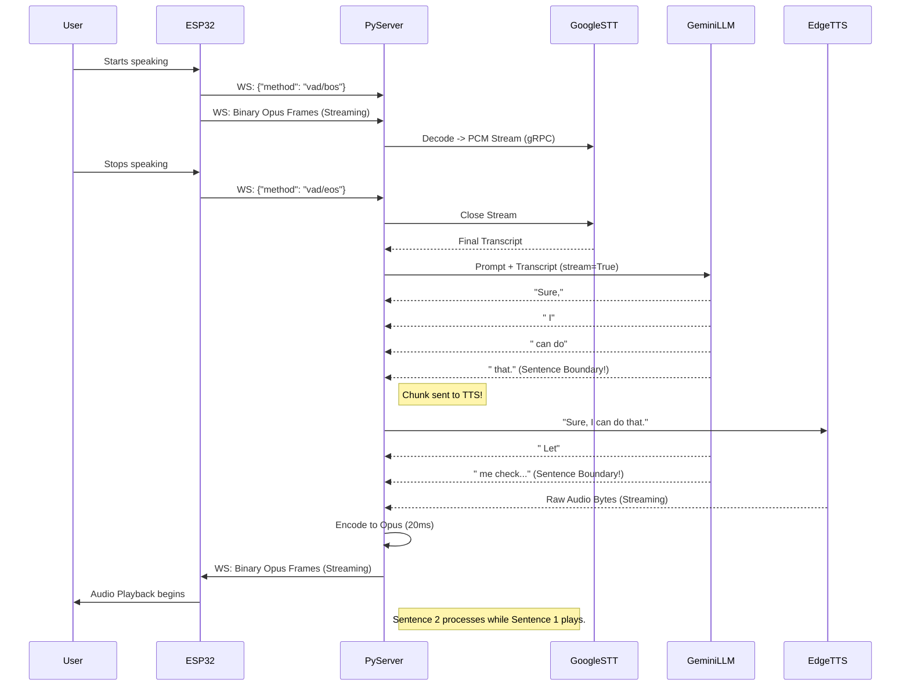

# AI Orchestration Pipeline - Detailed Architecture

This document expands on the `server_architecture_plan.md` to describe the AI pipeline in excruciating detail. Because this system is designed for real-time conversational latency (targeting sub-500ms Time-To-First-Byte), a traditional "Wait for Audio -> Send to STT -> Wait for Text -> Send to LLM -> Wait for Response -> Send to TTS -> Play" synchronous waterfall model is entirely unacceptable.

Instead, the pipeline heavily relies on **Asyncio Streaming**, **Pipelined Chunking**, and **Preemptive Transcoding**.

---

## 1. The Trigger: Streaming Audio & VAD Synchronization

The ESP32 does not send audio continuously. It utilizes an onboard Voice Activity Detector (VAD).

1. **VAD Start (`vad/bos`)**: When the user begins speaking, the ESP32 sends a JSON-RPC message: `{"method": "vad/bos"}` (Begin Of Speech), immediately followed by binary Opus frames.
2. **Opus Decoding (Real-time)**: As binary Opus frames arrive at the server's WebSocket, an `asyncio.Task` immediately decodes them into raw 16kHz PCM using `opuslib`.
3. **STT Streaming (Real-time)**: The raw PCM is *not* just buffered in memory. It is immediately yielded into a gRPC streaming connection to the **Google Cloud Speech-to-Text API**. This means Google is transcribing the audio *while* the user is still speaking.
4. **VAD End (`vad/eos`)**: When the user stops speaking, the ESP32 sends `{"method": "vad/eos"}`. 
5. **Finalizing STT**: The server closes the STT gRPC stream. Because Google was transcribing in real-time, the final transcription result is returned in milliseconds, rather than the seconds it would take to upload a full audio file.

---

## 2. The Brain: Gemini 1.5 Flash & LLM Orchestration

Once the final text transcription is received, it is passed to the LLM Manager.

### 2.1. Context & Prompt Injection
The user's text is appended to the **Session Memory** (a running list of `{"role": "user", "content": "..."}` and `{"role": "assistant", "content": "..."}` messages).
The system prompt injects hardware context: *"You are controlling an ESP32. You have tools available. Keep answers conversational and concise."*

### 2.2. Streaming LLM Generation
The server makes an asynchronous request to the Gemini API with `stream=True`. The LLM begins returning text tokens almost immediately.

### 2.3. Tool Calling & Model Context Protocol (MCP) Intercept
Gemini 1.5 Flash natively supports function calling.
- If Gemini decides the user's intent is to control the hardware (e.g., "turn on the red light"), it will return a `function_call` payload instead of text tokens.
- **The Intercept:** The Python server intercepts this tool call. It does *not* send audio to the user yet.
- **MCP Translation:** It translates the tool call into an MCP JSON-RPC message: 
  `{"jsonrpc": "2.0", "method": "tools/call", "params": {"name": "set_led", "arguments": {"color": "red"}}, "id": "req-1"}`
- **Execution:** The message is sent to the ESP32 via WebSocket. The server `await`s the ESP32's JSON-RPC response.
- **Resumption:** Once the ESP32 replies `{"jsonrpc": "2.0", "result": {"success": true}, "id": "req-1"}`, this result is appended to the LLM context, and the LLM is prompted to continue generating its conversational response (e.g., "I've turned the light red for you.").

---

## 3. The Voice: Edge-TTS & Sentence Boundary Chunking

This is the most critical stage for perceived latency. We cannot wait for the LLM to finish its entire paragraph before generating audio.

### 3.1. The Chunking Accumulator
As the LLM yields text tokens, they are fed into a text accumulator. The accumulator uses a regular expression to look for **Sentence Boundaries** (e.g., `.`, `!`, `?`, or sometimes `,` or `\n`).

*Example:* 
LLM yields: `"The"` -> `" sky"` -> `" is"` -> `" blue."`
The accumulator detects the period. It immediately slices "The sky is blue." and sends it to the TTS engine, while continuing to accumulate the next tokens from the LLM.

### 3.2. Edge-TTS Generation
The chunked sentence is sent to **Edge-TTS**. Edge-TTS opens an asynchronous WebSocket connection to Microsoft's Azure TTS endpoint. 
Azure begins streaming back the synthesized voice as an MP3 or raw PCM byte stream. 

---

## 4. The Downlink: Preemptive Transcoding & Transmission

As Edge-TTS streams bytes back for the first sentence:

1. **Format Conversion**: If Edge-TTS returns MP3, it is piped through an in-memory `ffmpeg` process or `pydub` to convert it to 16kHz, 16-bit mono PCM.
2. **Opus Framing**: The raw PCM is sliced into exact 20ms or 40ms windows (320 or 640 samples).
3. **Opus Encoding**: These windows are passed to `opuslib.Encoder`.
4. **Immediate Transmission**: The resulting binary Opus packets are instantly pushed down the WebSocket to the ESP32.

Because this happens while the LLM is *still* generating sentence 2, and Edge-TTS is *still* processing sentence 2, the ESP32 receives the first audio packet and begins playback within hundreds of milliseconds of the user finishing their sentence.

---

## 5. Advanced Flow & Edge Cases

### 5.1. The "Barge-in" (Interruption Handling)
What happens if the user starts speaking while the AI is replying?
1. The ESP32's VAD detects new speech and sends a `{"method": "vad/bos"}` message over the WebSocket.
2. **The Global Cancellation Token:** The server must immediately recognize this as an interruption.
3. The server triggers an `asyncio.Event` (e.g., `cancel_generation_event.set()`).
4. This instantly terminates the LLM stream, drops the TTS WebSocket connection, and flushes all audio buffers.
5. The server immediately transitions back to the STT Streaming phase to listen to the new user input.

### 5.2. Visual Sequence Flow

